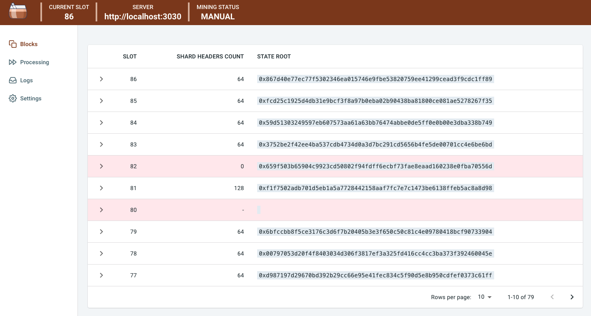

Mousse is an Ethereum 2.0 emulator for local testing of Eth2 applications (mainly Rollups).



## Getting Started

### Run Eth2 Emulator
You can run the Ethereum 2.0 emulator with the following commands:
```
$ cargo build --release
$ ./target/release/http_api
```

### Run Dashboard
If you want to use the GUI to visualize and control the emulator, run the dashboard by entering the following commands:
```
$ cd dashboard
$ npm start
```

## Eth2 Emulator Server
The implementation of the emulator server is in the `http_api` directory, and the Ethereum 2.0 simulator `simulator` is running inside. The emulator API definition is located in the [http_api/reference](http_api/reference) directory.

